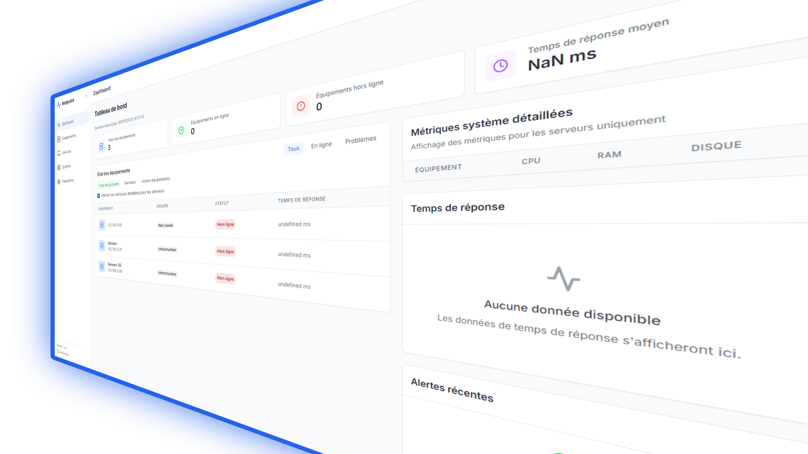
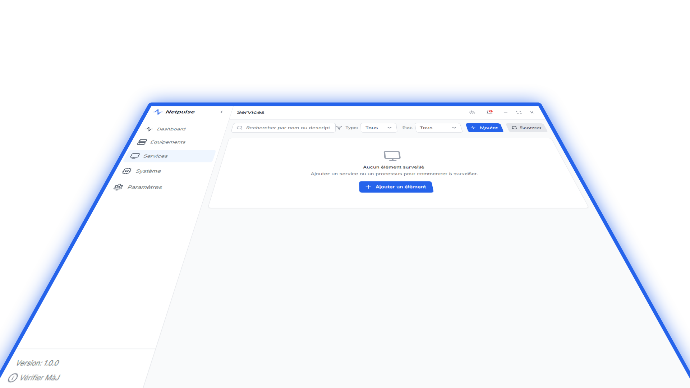
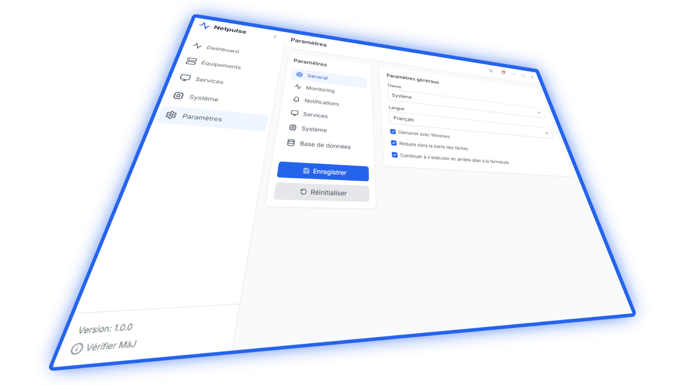

# NetPulse 🚀

  

  <h2>Surveillez votre réseau en toute simplicité avec NetPulse !</h2>

NetPulse est une application de bureau intuitive et performante conçue pour vous aider à garder un œil sur l'activité de votre réseau. Que vous soyez un utilisateur domestique curieux ou un professionnel ayant besoin d'un outil de diagnostic rapide, NetPulse vous offre les informations dont vous avez besoin de manière claire et accessible.

---

## ✨ Fonctionnalités Principales

*   📊 **Tableau de Bord Intuitif :** Visualisez les données clés de votre réseau en un coup d'œil.
*   📡 **Surveillance en Temps Réel :** Suivez l'utilisation de la bande passante, les connexions actives et d'autres métriques essentielles.
*   ⚙️ **Gestion des Services :** Surveillez et gérez les services réseau (basé sur les fonctionnalités de l'application).
*   💻 **Informations Système :** Accédez aux informations pertinentes de votre système (basé sur les fonctionnalités de l'application).
*   🔄 **Mises à Jour Automatiques :** NetPulse se maintient à jour automatiquement. Vous recevrez une notification lorsqu'une nouvelle version est disponible, vous assurant de toujours bénéficier des dernières fonctionnalités et améliorations.

---

## 📸 Aperçus de l'Application

  <h3>Tableau de bord principal</h3>
  
  
  <h3>Vue de la surveillance des services</h3>
  
  
  <h3>Notification de mise à jour</h3>
  

---

## 📥 Installation

Ce dépôt (`netpulse-updates`) héberge les versions exécutables (`.exe`) de NetPulse.

1.  **Téléchargez la dernière version :**
    *   Rendez-vous dans la section [Releases](https://github.com/lv-h2o/netpulse-updates/releases) de ce dépôt.
    *   Téléchargez le fichier `NetPulse-Setup-X.Y.Z.exe`.
2.  **Lancez l'exécutable :**
    *   Double-cliquez sur le fichier `.exe` téléchargé.
    *   Suivez les instructions à l'écran pour installer NetPulse.
3.  **Profitez de NetPulse !**

---

## 🚀 Mises à Jour

NetPulse intègre un système de mise à jour automatique. Lorsque vous lancez l'application et qu'une nouvelle version est détectée :
1.  Vous recevrez une notification vous informant de la disponibilité d'une mise à jour.
2.  Il vous sera demandé de confirmer si vous souhaitez télécharger et installer la nouvelle version.
3.  Après confirmation, la mise à jour sera téléchargée et installée automatiquement.

Ce dépôt (`netpulse-update`) est la source utilisée par l'application pour vérifier et télécharger ces mises à jour.

---

  
Merci d'utiliser NetPulse ! 💙

